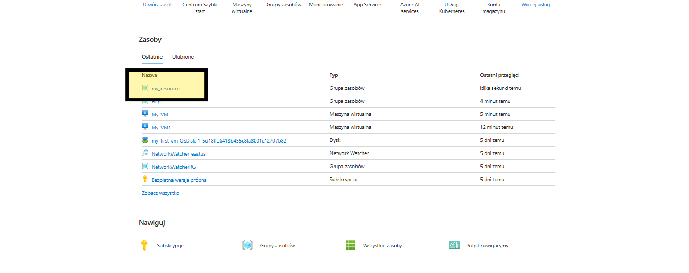
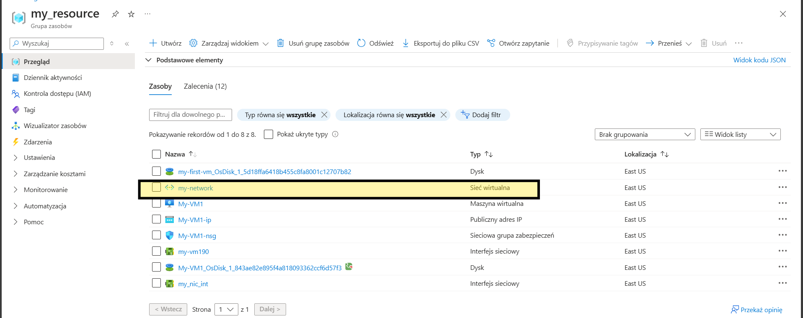
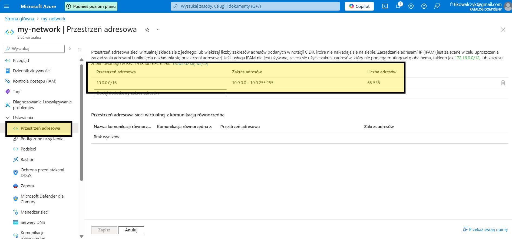
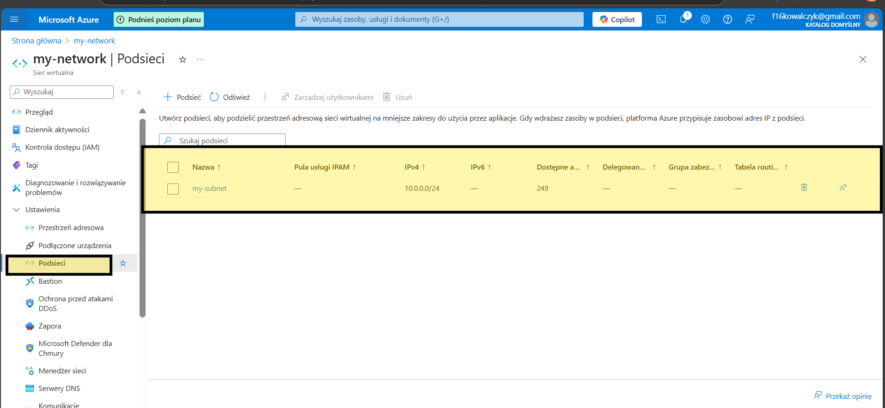
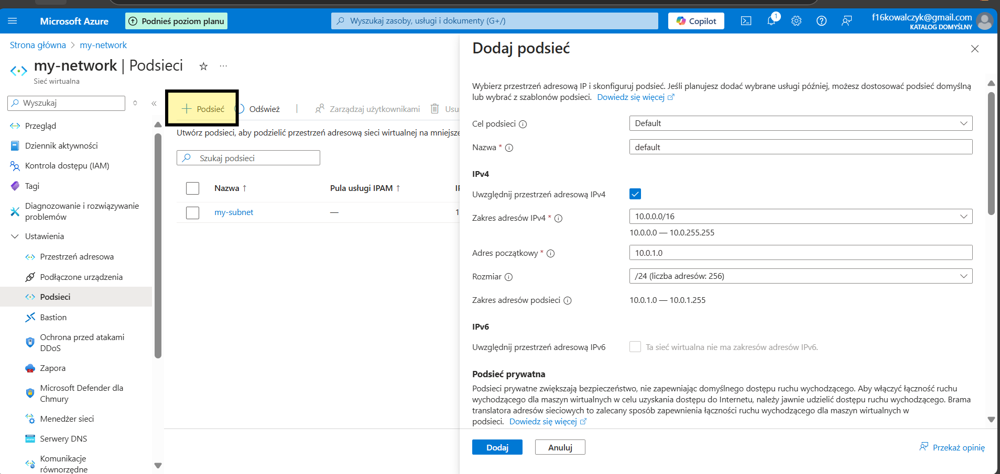

# VM_Network
 How to create VM Network

If you need create your virtual network check this.

Click on the VM with you need add to network 

Next go to Networking

on this place you can check open port

Next go to resourse

and to VM Network

on this area you can check your IP resourse

and subnet 

