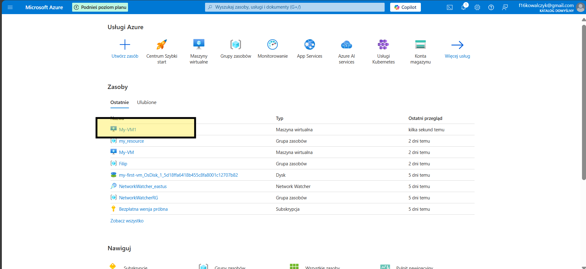
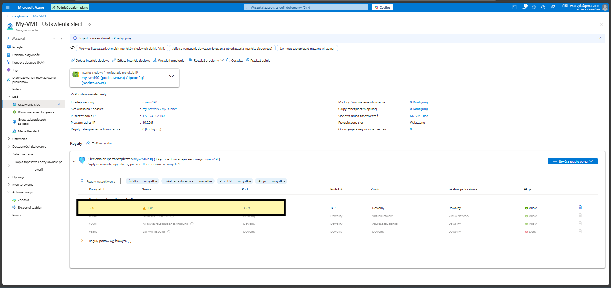

# VM_Network
 How to create VM Network

If you need create your virtual network check this.

Click on the VM with you need add to network 

Next go to Networking

on this place you can check open port

